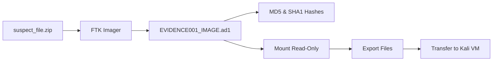

<p align="center">
  <br>
  
  <br><br>
</p>

<p align="center">
  <b>Title:</b> <i>An explanation of how this data exfiltration case was approached.</i>
</p>

<br>

---

## 📝 Case Overview

> A company suspects that an employee copied confidential files to a USB drive before leaving. This case documents the **acquisition, preservation, analysis, and findings** based on the provided evidence file: **`suspect_file.zip`**.

The goal was to simulate a real-world **DFIR workflow** while maintaining forensic integrity throughout the entire investigation process.

<br>

---

## 📁 Case Folder Structure

The following directory structure was created to organize evidence and maintain a proper **chain of custody**:

```
CASE001/
│
├── EVIDENCE001/                  → Original suspect_file.zip
├── EVIDENCE001IMAGES/            → Forensic image (EVIDENCE001IMAGE.ad1)
├── EVIDENCE001_EXPORTEDFILES/    → Safely exported files from the image
├── CASE001_REPORTS/              → Notes, findings, documentation
└── CASE001_SCREENSHOTS/          → Screenshots taken during analysis
```

> This structure ensures **separation of original evidence**, working copies, and analysis artifacts — a critical tenet of forensic soundness.

<br>

---

## 🔍 Tools Used

| Tool | Purpose |
|------|---------|
| **FTK Imager** | Evidence acquisition, imaging, hashing, and mounting |
| **ExifTool** | Metadata extraction from file artifacts |
| **DB Browser for SQLite** | Browser history analysis |
| **Hexdump / strings / unzip** | Deep file inspection and carving |
| **Mousepad / Notepad** | Viewing text-based artifacts |

<br>

---

## 🧩 Evidence Identification

Three key evidence items were identified inside the exported folder:

| Evidence | Relevance |
|----------|-----------|
| **`browser_history.sqlite`** | Indicates online services accessed (e.g., cloud storage, file transfer sites) |
| **`CompanyFinancials2024.docx`** | A confidential document allegedly copied to the USB |
| **`usb_activity.log`** | Provides a timestamped log of USB connection and file copy events |

### 📎 Additional Artifacts

| Artifact | Description |
|----------|-------------|
| `.recovered` fragments | Recovered deleted or hidden file fragments |
| `clientlist.xlsx` | Internal client list spreadsheet |
| `exitnotes.txt` | Admission note left by the suspect |
| `filemetadata.json` | Metadata pertaining to sensitive files |
| `screenshot1.png` | Suspicious/corrupted screenshot file |
| `holidayphotos.txt` | Miscellaneous text file |

<br>

---

## 🖥️ Evidence Acquisition Process



| Step | Action |
|:----:|--------|
| 1 | Stored the original `suspect_file.zip` in `EVIDENCE001/` **without modification** |
| 2 | Used **FTK Imager** to create a forensic image: `EVIDENCE001_IMAGE.ad1` |
| 3 | FTK Imager automatically generated **MD5 and SHA1 hashes** to verify integrity |
| 4 | Mounted the `.ad1` image **read-only** to prevent alteration |
| 5 | Exported all files from the mounted image into `EVIDENCE001_EXPORTEDFILES/` |
| 6 | Transferred exported files to a **forensic Kali machine** for deeper analysis |

> ✅ This workflow maintains **forensic soundness** and ensures the original evidence remains untouched.

<br>

---

## 🧪 Analysis Summary

<br>

### 🌐 Browser History — `browser_history.sqlite`

Two URLs were found in the SQLite database:

| URL | Platform | Relevance |
|-----|----------|-----------|
| `https://drive.google.com` | Google Drive | Cloud storage — potential exfiltration vector |
| `https://wetransfer.com` | WeTransfer | File transfer — potential exfiltration vector |

> These are **common data exfiltration platforms**, supporting the suspicion of unauthorized file transfer.

<br>

### 📝 Exit Notes — `exit_notes.txt`

> *"I have copied everything I need before leaving. No one will notice since I used the USB late at night."*

> ⚠️ This is a **direct admission of intent** and is strongly incriminating evidence.

<br>

### 📄 Metadata — `file_metadata.json`

| File | Author | Origin |
|------|--------|--------|
| `CompanyFinancials2024.docx` | John Doe | Internal company system |
| `client_list.xlsx` | Jane Smith | Internal company system |

> Confirms these files **originated from internal company systems**.

<br>

### 🖼️ Screenshot Metadata — `screenshot1.png`

| Attribute | Value | Analysis |
|-----------|-------|----------|
| **File size** | 25 bytes | Corrupted or intentionally manipulated |
| **Permissions** | `-rw-rw-rw-` | Insecure — suspicious |
| **Header** | *"PNG image did not start with IHDR"* | Malformed file |
| **Timestamps** | Aligns with suspicious activity | Corroborating evidence |

**Possible explanations:**
- 🕵️ Attempt to hide data within the image
- 🎭 Fake or decoy screenshot
- 💥 Corrupted evidence

<br>

### 📑 CompanyFinancials2024.docx

| Attribute | Finding |
|-----------|---------|
| **File size** | 174 bytes — far too small for a legitimate DOCX |
| **File type** | Detected as `text/plain`, not DOCX |
| **Verdict** | Likely a **decoy or disguised file** |

Using `strings`, `hexdump`, and `unzip`, the **real content** was recovered:

> **CONFIDENTIAL**
> **Company Financial Summary 2024**
> - Revenue: $4.5 Million
> - Projected Growth: 18%
> - New Client Acquisition Strategy
> - Internal Use Only
>
> *Prepared by: Finance Department*

> ✅ This confirms **confidential data was present** on the USB.

<br>

### 🔌 USB Activity Log — `usb_activity.log`

| Timestamp | Event |
|-----------|-------|
| `2026-04-10 22:14:03` | 🟢 **USB device connected** |
| `2026-04-10 22:15:10` | 📁 File copied: `CompanyFinancials2024.docx` |
| `2026-04-10 22:16:45` | 📁 File copied: `client_list.xlsx` |
| `2026-04-10 22:20:01` | 🔴 **USB device removed** |

> This log provides **direct evidence of data exfiltration**, with precise timestamps mapping the entire incident.

<br>

### 🔐 Recovered Passwords — `.recovered/passwords.txt`

| Username | Password | Suspicion |
|----------|----------|-----------|
| `admin` | `admin123` | Weak/default credentials |
| `finance` | `fin@2024` | May have been used to access restricted files |

<br>

---

## 🔐 Integrity Verification

| Hash Algorithm | Value |
|:--------------:|-------|
| **MD5** | `de461f4711686163d49e6c91f264d0ac` |
| **SHA1** | `1c75726934bbf476c8fdbab62805e3a0923becf4` |

> Hashing ensures:
> - ✅ Evidence was **not altered** during the investigation
> - ✅ Acquisition process was **forensically sound**
> - ✅ Findings are **admissible in court**

<br>

---

## 🚨 Suspicious Findings — Summary

| # | Finding | Severity |
|:-:|---------|:--------:|
| 1 | Evidence of file copying to USB at **late hours** | 🔴 High |
| 2 | Access to **cloud storage platforms** (Google Drive, WeTransfer) | 🔴 High |
| 3 | **Confession note** indicating malicious intent | 🔴 High |
| 4 | **Confidential financial data** found inside disguised files | 🔴 High |
| 5 | **Manipulated or corrupted screenshot** | 🟡 Medium |
| 6 | **Recovered passwords** suggesting unauthorized access | 🟡 Medium |

<br>

---

## 🧾 Conclusion

> The forensic analysis **strongly supports** the suspicion that the employee copied confidential company files to a USB drive. Multiple artifacts — including logs, metadata, browser history, and the exit note — confirm **intentional data exfiltration**.

This case successfully demonstrates:

| Skill Area | Demonstrated |
|------------|:------------:|
| 🔍 Proper evidence acquisition | ✅ |
| 🔐 Integrity preservation | ✅ |
| 🧩 Artifact analysis | ✅ |
| ⏱️ Timeline reconstruction | ✅ |
| 🎯 Identification of malicious intent | ✅ |

<br>

---

## 📚 Skills Practiced

<div align="center">
  <table>
    <tr>
      <td align="center">🔍 <b>Evidence Identification</b></td>
      <td align="center">💾 <b>Imaging & Hashing</b></td>
      <td align="center">📋 <b>Metadata Analysis</b></td>
    </tr>
    <tr>
      <td align="center">🗄️ <b>SQLite Browser History Analysis</b></td>
      <td align="center">🪚 <b>File Carving & Deep Inspection</b></td>
      <td align="center">📅 <b>Timeline Reconstruction</b></td>
    </tr>
    <tr>
      <td align="center">🎯 <b>Intent Assessment</b></td>
      <td align="center">📝 <b>Documentation & Reporting</b></td>
      <td align="center"></td>
    </tr>
  </table>
</div>

<br>

---

<p align="center">
  <br>
  
  
  
  <br>
  
</p>

<br>

---

<p align="center">
  <sub><i>This investigation was conducted in a controlled educational laboratory environment for cybersecurity training and forensic skill development.</i></sub>
</p>
